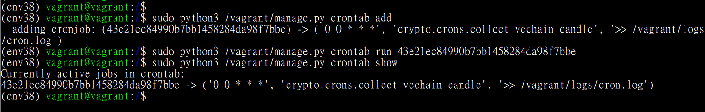

# Django RESTful API for data visualization web app
* Python 3.8
* Django 3.0.8
* Apache 2
* Postgresql 12


## Requirements
1. [Virtualbox 6.1.16](https://www.virtualbox.org/wiki/Downloads)
2. [Vagrant 2.2.14](https://www.vagrantup.com/downloads)
3. Use with **cshimegi/data-visualization-gui**

## Installation from scratch
##### Notification
If you want to install from scratch, please refer to branch **master**.

##### Steps
* Step 1
`git clone https://github.com/cshimegi/analysis-api.git`

* Step 2
```bash
$  cd /to/Vagrantfile/path
$  vagrant up --provision
```

* Step 3
```bash
$  vagrant ssh
$  sudo systemctl stop apache2
$  source /env38/bin/activate
$  sudo pip3 install -r /vagrant/requirements.txt
$  sudo python3 /vagrant/manage.py makemigrations
$  sudo python3 /vagrant/manage.py migrate
$  sudo python3 /vagrant/manage.py collectstatic -c --no-input
$  sudo python3 /vagrant/manage.py crontab add
$  sudo python3 /vagrant/manage.py crontab run <cron job hash value>
$  sudo python3 /vagrant/manage.py crontab show // ---> check if added or not
$  deactivate
$  sudo systemctl start apache2
```

#### Reference for Crontab



## Access to Django WEB
After Vagrant is booted, you can access API page from browser.

* API Page: `http://192.168.12.2:8080/api/v1`
* Admin Site: `http://192.168.12.2:8080/admin`

## Useful Commands
### Vagrant
```bash
$  vagrant up  //  to strat
$  vagrant up --provision //  to strat and provision
$  vagrant ssh  //  connect by SSH
$  vagrant halt // to halt
```

### Ubuntu (bento/ubuntu-20.10)
```bash
$  source /env38/bin/activate // activate virtual python3 env
$ (env38) deactivate // deactivate virtual python3 env
$ (env38) sudo python3 /vagrant/manage.py crontab add // add not registered crontab jobs
$ (env38) sudo python3 /vagrant/manage.py crontab run <crontab job hash value> // run specified registered crontab job
$ (env38) sudo python3 /vagrant/manage.py crontab show // list all added crontab jobs
```
